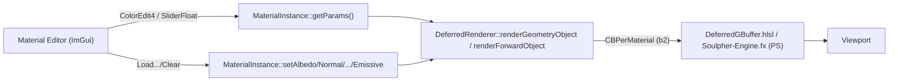
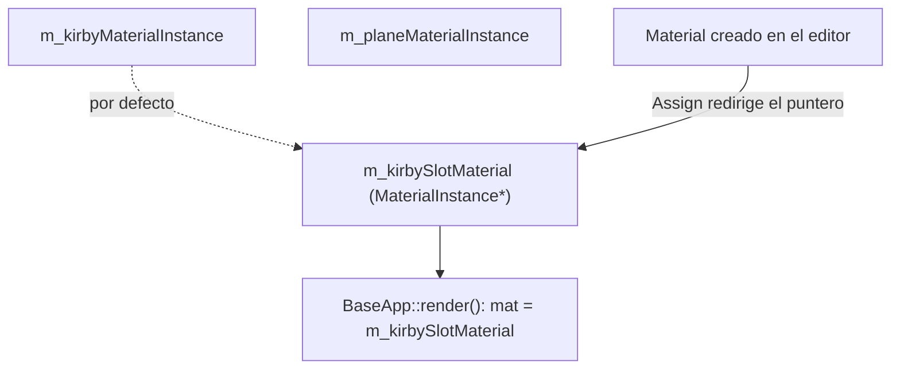
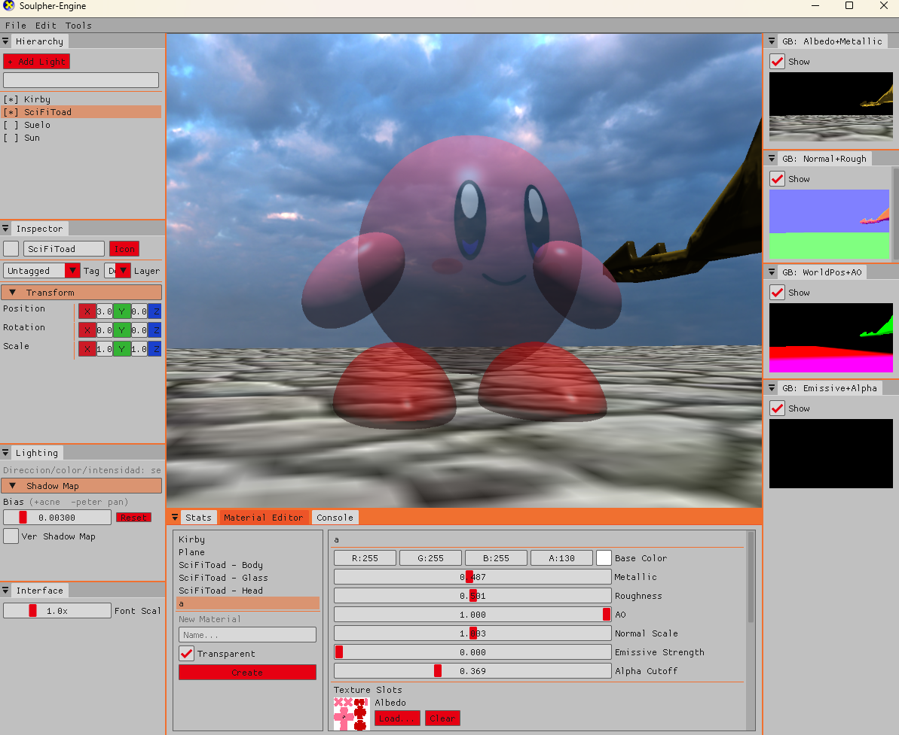
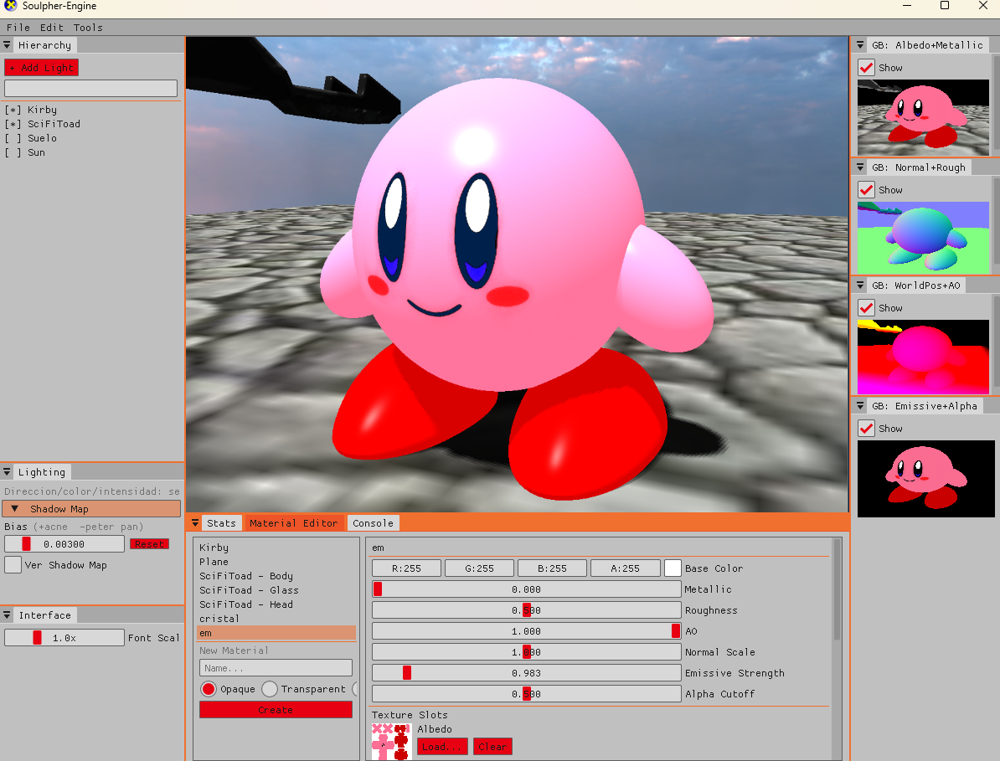

# Material Editor — Documentación Técnica (Parcial 3)

> Herramienta complementaria al motor: un panel in-engine, construido con Dear ImGui, para
> crear y editar materiales PBR en vivo — parámetros y texturas — sin recompilar ni tocar
> código, y asignarlos a los objetos de la escena demo.

---

## 1. Propuesta

Hasta el Parcial 2, cambiar cualquier propiedad de un material en Soulpher-Engine (el color
base de Kirby, la rugosidad del vidrio de SciFiToad, qué textura usa el suelo) significaba
editar un valor en `BaseApp::init()` y recompilar. Es el mismo problema que resuelve
cualquier motor de producción con un **editor de materiales**: separar "qué aspecto tiene
este objeto" de "el código que arma la escena", para que ese aspecto se pueda iterar en
segundos, en vivo, sin recompilar — y sin que la persona iterando necesite tocar C++.

La herramienta propuesta e implementada es un **Material Editor** in-engine, inspirado en el
**Material Instance Editor** de Unreal Engine mencionado y usado en clase, pero deliberadamente
simplificado: sin grafo de nodos (Unreal separa "definir el shader" de "instanciar
parámetros"; aquí el shader ya está fijo y compilado — HLSL — así que el editor solo
expone los parámetros que ese shader ya declara en `CBPerMaterial`). Permite:

- **Crear materiales desde cero** — nombre, dominio (Opaque / Transparent / Masked).
- **Editar en vivo** sus 7 parámetros PBR (BaseColor RGBA, Metallic, Roughness, AO,
  NormalScale, EmissiveStrength, AlphaCutoff) — cambios visibles en el viewport frame a frame.
- **Cargar y quitar texturas** por slot (Albedo, Normal, Metallic, Roughness, AO, Emissive)
  con thumbnail en vivo.
- **Asignar cualquier material** (built-in o creado en el editor) a cualquiera de los 5
  "huecos" de render que la escena demo expone (Kirby, Plano, SciFiToad Body/Glass/Head).
- **Borrar materiales creados en el editor** — protegido: los 5 materiales built-in no son
  borrables (identifican un Render Slot por nombre), y un material creado que esté
  actualmente asignado a un Render Slot se bloquea hasta reasignar ese slot a otro material.

---

## 2. Investigación: el sistema de materiales en otros motores

### 2.1 Unreal Engine — `Material` vs. `Material Instance`

Unreal separa dos conceptos que en Soulpher-Engine también están separados (`Material` vs.
`MaterialInstance`, ver §3.1), pero con una diferencia clave: en Unreal el **Material**
*es* el grafo de nodos que se compila a shader (HLSL/shader permutations generadas), y una
**Material Instance** es un contenedor de *overrides* sobre parámetros que ese grafo marcó
como "instanciables" (`Parameter` nodes). El **Material Instance Editor** — la UI que
inspiró esta herramienta — muestra esos parámetros agrupados, con un checkbox por parámetro
para "heredar del padre" o "sobreescribir aquí", y una esfera de preview en vivo.

- Documentación oficial usada como referencia:
  [Unreal Engine Material Instance Editor UI](https://dev.epicgames.com/documentation/unreal-engine/unreal-engine-material-instance-editor-ui)
  y [Instanced Materials in Unreal Engine](https://dev.epicgames.com/documentation/unreal-engine/instanced-materials-in-unreal-engine).

> 📘 **Nota GameDev:** la razón por la que Unreal separa Material/Material Instance (y por
> qué Soulpher-Engine ya lo hacía antes de esta herramienta) no es solo organizativa — es de
> **costo de compilación de shaders**. Cambiar un parámetro de una Instance es una escritura
> de un constant buffer, instantánea. Cambiar el grafo del Material base dispara una
> recompilación de shader (potencialmente de todas sus permutaciones — distintas
> combinaciones de features activas). Un editor de materiales *tiene* que operar sobre
> instancias si quiere ser interactivo en tiempo real; esto define el límite exacto de lo
> que este Material Editor puede exponer: los 7 campos que ya existen en `CBPerMaterial`
> (compilados una sola vez en `Soulpher-Engine.fx`/`DeferredGBuffer.hlsl`), no nuevos nodos
> de shader.

### 2.2 Contraste rápido: Unity y Godot

Unity no separa Material/Material Instance como Unreal — un `Material` de Unity ya *es* la
instancia (referencia a un `Shader` + un bag de propiedades serializadas), más parecido en
espíritu a como quedó `MaterialInstance` aquí (una instancia de un `Material`/shader fijo).
Godot 4 (`StandardMaterial3D`) es aún más directo: un solo recurso con todos los campos PBR
como propiedades del Inspector, sin instancia separada — el diseño más cercano a lo que este
Material Editor termina exponiendo en la práctica, aunque el *patrón* interno (Material +
MaterialInstance) siga el modelo de Unreal.

### 2.3 El estándar detrás de los parámetros: glTF 2.0 metallic-roughness

Los 7 campos de `MaterialParams`/`CBPerMaterial` (BaseColor, Metallic, Roughness, AO,
NormalScale, EmissiveStrength, AlphaCutoff) no son arbitrarios: son, casi campo por campo,
el modelo **metallic-roughness** de glTF 2.0 — el estándar de facto que Unity, Unreal, Godot
y Blender usan como superficie común de intercambio de materiales PBR.

- [Khronos — glTF 2.0 PBR (guía)](https://www.khronos.org/gltf/pbr/)
- [glTF 2.0 — especificación completa](https://registry.khronos.org/glTF/specs/2.0/glTF-2.0.html)

> 📘 **Nota GameDev:** que el motor ya haya elegido metallic-roughness (en vez de, por
> ejemplo, specular-glossiness, el otro modelo PBR común en motores más viejos) es lo que
> hace que este Material Editor "signifique lo mismo" para alguien que ya usó Unity/Unreal/
> Blender — `roughness=0` es espejo perfecto y `roughness=1` es difuso total en los cuatro,
> por diseño del estándar, no por casualidad.

---

## 3. Arquitectura existente antes de la herramienta

### 3.1 El sistema de materiales de Soulpher-Engine

`Material` (`Rendering/Material.h`) define el **dominio** (`Opaque`/`Masked`/`Transparent`),
el **blend mode**, y qué `RasterizerState`/`DepthStencilState`/`SamplerState`/`ShaderProgram`
usar. `MaterialInstance` (`Rendering/MaterialInstance.h/.cpp`) referencia un `Material*` y
añade lo que varía por objeto: hasta 6 `Texture*` (Albedo/Normal/Metallic/Roughness/AO/
Emissive) y un `MaterialParams` (los 7 campos de arriba). Este par ya estaba completamente
desacoplado de `Actor` — `BaseApp` posee sus `MaterialInstance` directamente y los pasa al
renderer envueltos en un `RenderObject` cada frame.



### 3.2 El cuello de botella real: el wiring por nombre en `BaseApp::render()`

Lo que **no** estaba desacoplado es *qué actor usa qué `MaterialInstance`*. `BaseApp::render()`
identifica actores por nombre (`if (name == "Kirby") ... else if (name == "SciFiToad")`) y a
mano les asigna su `MaterialInstance`. Este hallazgo — que el pipeline real de la demo pasa
por `BaseApp::render()`, no por los campos propios de `Actor` (`m_materialCB`,
`std::vector<Texture>`, que resultaron ser legado sin usar) — definió el diseño entero de la
herramienta: **el editor nunca podía tocar `Actor`**, porque ahí no vive el wiring real.

### 3.3 Archivos identificados y su rol

| Archivo | Rol en la herramienta |
|---|---|
| `include/UserInterface.h` / `src/UserInterface.cpp` | Panel `materialEditor()`: UI, structs `MaterialEditorEntry`/`MaterialRenderSlot`. |
| `include/BaseApp.h` / `src/BaseApp.cpp` | Pools de materiales/texturas creados en el editor, punteros `*SlotMaterial`, wiring hacia `RenderObject`. |
| `include/Rendering/RenderTypes.h` | `MaterialParams`, `CBPerMaterial`, nuevo campo `RenderObject::tint`. |
| `include/Rendering/DeferredRenderer.h` / `.cpp` | Consumo de `MaterialInstance` en los pases opaco y transparente; helpers compartidos (`bindTextureFallbacks`, `computeTintedBaseColor`). |
| `Rendering/Material.h`, `Rendering/MaterialInstance.h/.cpp` | Ya existían — no se modificaron; el editor los usa tal cual. |

---

## 4. Diseño: cómo escalar sin tocar el wiring hardcodeado

### 4.1 El patrón de indirección — el paralelo directo con Unreal

La restricción del §3.2 (no tocar el `if/else` por nombre) más el requisito de "asignar
cualquier material a cualquier slot" llevaron al mismo patrón que usa Unreal para sus
**Material Slots** [3]: un `StaticMeshComponent` no referencia un `Material` directamente, tiene
un arreglo de *slots* nombrados, y cada slot apunta a lo que sea que esté asignado ahí — el
mesh en sí no cambia cuando se reasigna un slot. La documentación oficial lo confirma
explícitamente: reasignar un material en el Static Mesh Editor lo vuelve "el material por
defecto de la malla y de cualquier instancia colocada en el nivel", mientras que reasignarlo
en una instancia puesta en el nivel "no afecta a la malla base" — la misma separación
asset/instancia que motivó `MaterialRenderSlot::target` aquí: reasignar el puntero cambia lo
que se dibuja sin tocar ni el `Actor` ni el `MaterialInstance` original.

Aquí eso se implementó como `MaterialRenderSlot { label, MaterialInstance** target }`: el
`target` es la dirección del puntero que `BaseApp::render()` de verdad lee cada frame
(`m_kirbySlotMaterial`, etc.). El botón "Assign" del editor hace una sola escritura,
`*target = inst;`, y el frame siguiente el objeto se dibuja con el material nuevo — sin
ningún cambio en el `if (name == "Kirby")`.



### 4.2 Buckets para materiales por submesh (SciFiToad)

El mismo problema existe un nivel más abajo para SciFiToad, que no tiene un `MaterialInstance`
por actor sino uno **por submesh** (Body/Glass/Head, elegidos originalmente por nombre de
nodo FBX). La solución generaliza el mismo patrón: en vez de guardar el
`MaterialInstance*` final por submesh, se guarda a qué **bucket** (0=Body/1=Glass/2=Head)
pertenece cada submesh — decidido una sola vez al cargar el FBX — y ese bucket se resuelve
cada frame contra los mismos tres punteros de slot que el editor puede reasignar. Es
`MaterialRenderSlot` aplicado a nivel de submesh en vez de a nivel de actor.

### 4.3 Camino de escalabilidad hacia N slots sin N ramas hardcodeadas

Hoy agregar un 6.º slot (un actor nuevo) sigue requiriendo tocar 4 lugares a mano: el
`MaterialInstance` miembro, su puntero `*SlotMaterial`, las entradas en
`m_materialEditorEntries`/`m_materialRenderSlots`, y la rama `else if (name == ...)` en
`render()`. El patrón de indirección ya construido es exactamente lo que hace falta para
dar el siguiente paso sin rehacer nada: reemplazar esas 4 escrituras manuales por una
única estructura de datos — un `std::unordered_map<Actor*, std::vector<MaterialInstance*>>`
poblado al cargar cada actor — que tanto el editor como `render()` consulten. El
`MaterialRenderSlot`/bucket de esta entrega es, en los hechos, el prototipo de esa tabla:
demuestra que la indirección funciona antes de invertir en generalizarla a *cualquier* actor.

---

## 5. Implementación (realización del plan)

### 5.1 Estructuras nuevas

```cpp
struct MaterialEditorEntry { std::string name; MaterialInstance* instance; };
struct MaterialRenderSlot  { std::string label; MaterialInstance** target; };
```

Más dos pools en `BaseApp`, ambos `std::deque` (no `std::vector`) a propósito:
`m_editorLoadedTextures` y `m_editorCreatedMaterials`. `MaterialRenderSlot::target` y
`MaterialEditorEntry::instance` guardan punteros crudos hacia elementos de estos pools; un
`std::vector` puede reubicar todo su buffer al crecer (invalidando esos punteros), un
`std::deque` garantiza que `push_back`/`emplace_back` en los extremos nunca invalida
referencias a elementos ya insertados.

### 5.2 El panel del editor

`UserInterface::materialEditor()` sigue el mismo patrón ImGui que el resto del motor
(`inspectorGeneral`, `outliner`): una lista a la izquierda (`Selectable` por material), un
panel de detalle a la derecha con `ColorEdit4`/`SliderFloat` editando `MaterialParams&` por
referencia directa (sin copia intermedia), y un picker por slot de textura con thumbnail
real (`ImGui::Image` sobre el `ID3D11ShaderResourceView*` que `Texture::srv()` ya expone —
el backend DX11 de Dear ImGui lo acepta directo como `ImTextureID`, confirmado contra la
[documentación de Image Loading de Dear ImGui](https://github.com/ocornut/imgui/wiki/Image-Loading-and-Displaying-Examples)).

### 5.3 Bugs encontrados y corregidos durante el desarrollo

Construir la herramienta expuso varios bugs reales en el pipeline de render que nunca se
habían manifestado porque nadie había ejercitado esos caminos de código antes. Documentarlos
es, en sí, evidencia de investigación aplicada:

1. **El Base Color volvía a blanco cada frame.** `BaseApp::render()` recalculaba un tinte de
   resaltado de selección escribiendo directamente sobre `MaterialInstance::getParams()
   .baseColor` — el único valor que el editor también edita. Se resolvió separando la fuente
   de verdad persistente (`MaterialParams`, del material) del modificador transitorio de un
   solo draw (`RenderObject::tint`, aplicado solo en `DeferredRenderer`).
2. **Un material `Transparent` sin textura salía invisible.** El pase forward/transparente
   nunca tenía el mismo relleno de texturas de respaldo que el pase opaco — sampleando un SRV
   nulo, D3D11 devuelve `(0,0,0,0)`, así que el alpha de salida quedaba en 0 sin importar el
   slider. Se agregó el mismo `bindTextureFallbacks` que ya tenía el pase opaco.
3. **Solo SciFiToad podía ser transparente.** La lista de objetos transparentes (necesaria
   para que el pase forward los dibuje) solo se poblaba para SciFiToad, hardcodeado. Se
   generalizó a cualquier objeto cuyo material sea `MaterialDomain::Transparent`.
4. **`Alpha Cutoff` no hacía nada.** El shader del G-Buffer ya implementaba
   `clip(albedo.a - AlphaCutoff)`, pero el editor solo podía crear materiales Opaque o
   Transparent — nunca `Masked`, el único dominio para el que ese `clip` se activa. Se
   agregó un tercer material base (`m_maskedMaterial`) y una tercera opción en el creador.

### 5.4 Borrar materiales (Delete)

Agregado después de la primera entrega, sobre la misma arquitectura de pools (§5.1): un
botón "Delete" junto a "Duplicate" en el panel de detalle, visible solo para materiales con
índice `>= kBuiltInMaterialCount` (creados en el editor).

La decisión de diseño no obvia es **qué se borra**. `materialPool` es un `std::deque`
precisamente porque `push_back`/`emplace_back` nunca invalida punteros ya repartidos a
`MaterialEditorEntry::instance` o `MaterialRenderSlot::target` (§5.1) — pero esa garantía es
solo para inserciones. Un `erase()` en medio de un `std::deque` sí invalida todos los
iteradores/punteros del contenedor (no solo el elemento borrado), lo que rompería cualquier
otro material o render slot que todavía apunte al pool. Por eso "Delete" **no** llama
`materialPool.erase(...)`: solo quita la entrada de `materials` (el `std::vector` que
alimenta la lista del editor). La `MaterialInstance` borrada sigue viva en el pool —
huérfana, pero inofensiva — el mismo trade-off que ya asume `texturePool`, que tampoco libera
nunca sus elementos.

Segunda protección: antes de borrar se recorre `renderSlots` buscando si algún
`*(slot.target) == inst`; si el material está en uso, el botón se deshabilita (con tooltip)
en vez de borrar y dejar un `Render Slot` apuntando a una instancia fuera de la lista
editable sin ningún aviso.

---

## 6. Limitaciones actuales — caminos de escalabilidad

- **5 slots fijos, no asignación libre a cualquier actor nuevo.** Ver §4.3 — el camino ya
  identificado es generalizar `MaterialRenderSlot` a una tabla `Actor* → MaterialInstance*`
  poblada dinámicamente, en vez de miembros nombrados uno por uno.
- **La transparencia se ordena por objeto completo, no por submesh/triángulo.** Confirmado
  manualmente: un objeto cerrado con varias partes (Kirby) al que se le asigna un material
  Transparent puede mostrar partes internas normalmente ocultas, porque el pase transparente
  no escribe profundidad y dibuja las submallas de un mismo objeto en orden de array. El
  camino de escalabilidad real es implementar **Order-Independent Transparency** (depth
  peeling o per-pixel linked lists/A-buffer) o, como paso intermedio más barato, ordenar
  submallas (no solo objetos) por distancia dentro de `renderForwardObject`.
  Order-Independent Transparency es un área de investigación activa en tiempo real desde
  hace más de una década — que este motor no la implemente todavía es el estado normal de
  un renderer académico, no un defecto puntual de esta herramienta.
- **Sin drag & drop real entre el Outliner y el Material Editor.** Se evaluó explícitamente
  y se optó por un flujo de selector + botón "Assign" por menor riesgo bajo el tiempo
  disponible para esta entrega. El camino de escalabilidad es agregar
  `ImGui::BeginDragDropSource`/`Target` sobre las mismas estructuras (`MaterialEditorEntry`
  como fuente, `MaterialRenderSlot`/filas del Outliner como destino) — no requiere cambiar
  ningún dato, solo la interacción.

---

## 7. Pruebas de funcionamiento

**Creación y edición en vivo.** Material nuevo (`a`) creado desde cero, asignado a Kirby vía
"Assign to Render Slot", con textura Albedo cargada por `Load...` (thumbnail visible en el
panel derecho) y parámetros PBR editables en tiempo real:


**Transparencia funcionando.** El mismo material `a`, ahora con `Base Color Alpha = 130/255`
(~51%) — el rosa de Kirby se mezcla visiblemente con el cielo de fondo, confirmando blending
alfa real (`SRC_ALPHA`/`INV_SRC_ALPHA`) contra la escena ya iluminada, no una simulación:



**Iteración de UI durante las pruebas.** Los tres selectores de dominio (Opaque/Transparent/
Masked) como `RadioButton` en fila no entraban en el panel de 200px — "Masked" quedaba
cortado. Se reemplazó por un `Combo` desplegable (ver §5.2), consistente con el resto del
panel. Se incluye como evidencia del proceso de prueba/iteración, no del resultado final:



> 📝 **Pendiente antes de la entrega final:** agregar capturas del selector `Combo` ya
> corregido, de un material `Masked` con `Alpha Cutoff` recortando visiblemente un borde, y
> del flujo completo "Create → Assign" mostrando la lista sincronizada.

---

## 8. Glosario

| Término | Significado en este documento |
|---|---|
| **PBR** | Physically Based Rendering — modelo de shading que busca coherencia física (energía no creada de la nada) en vez de aproximaciones ad-hoc como Phong clásico. |
| **Dominio de material** | Opaque / Masked / Transparent — cómo el pixel shader resuelve el alpha: ignorado, recorte binario (`clip`), o blending real. |
| **Deferred vs. Forward** | Deferred calcula iluminación una vez por píxel final leyendo un G-Buffer; Forward la recalcula por cada fragmento de cada objeto que se dibuja, incluido el overdraw. |
| **OIT (Order-Independent Transparency)** | Familia de técnicas (depth peeling, A-buffer/per-pixel linked lists) que resuelven blending de transparencias correcto sin depender del orden de dibujo. |
| **SRV (Shader Resource View)** | Vista de D3D11 que permite a un shader leer un recurso (ej. una textura) via `Sample()`. |
| **CBPerMaterial** | Constant buffer (b2) con los 7 parámetros PBR que cambian por material — layout que debe coincidir byte a byte con el HLSL. |

---

## 9. Referencias

1. Epic Games. *Unreal Engine Material Instance Editor UI*.
   <https://dev.epicgames.com/documentation/unreal-engine/unreal-engine-material-instance-editor-ui>
2. Epic Games. *Instanced Materials in Unreal Engine*.
   <https://dev.epicgames.com/documentation/unreal-engine/instanced-materials-in-unreal-engine>
3. Epic Games. *Using Materials With Static Meshes in Unreal Engine*. — fuente directa del
   patrón de indirección de §4.1 (`MaterialRenderSlot`): confirma que un Static Mesh
   referencia *slots* nombrados, no materiales directamente, y que reasignar un slot a nivel
   de instancia no afecta al asset base.
   <https://dev.epicgames.com/documentation/unreal-engine/using-materials-with-static-meshes-in-unreal-engine>
4. Khronos Group. *glTF 2.0 — Physically-Based Rendering*.
   <https://www.khronos.org/gltf/pbr/>
5. Khronos Group. *glTF 2.0 Specification*.
   <https://registry.khronos.org/glTF/specs/2.0/glTF-2.0.html>
6. Luna, F. (2012). *Introduction to 3D Game Programming with DirectX 11*. Mercury Learning
   and Information. — arquitectura general del motor (wrappers RAII, XNA Math, patrón
   init/render/destroy).
7. ocornut/imgui. *Image Loading and Displaying Examples*.
   <https://github.com/ocornut/imgui/wiki/Image-Loading-and-Displaying-Examples>
